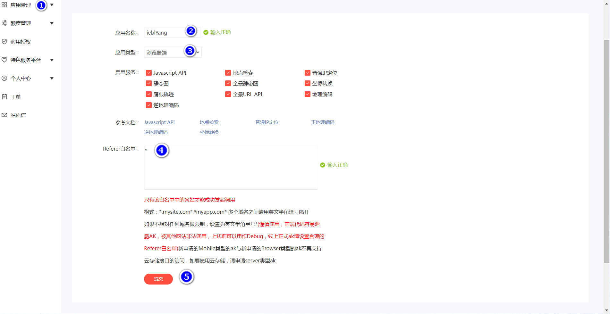
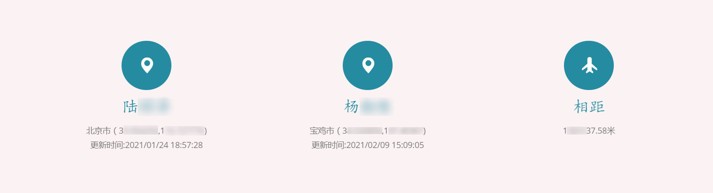

# 利用百度地图API实现网页定位与距离计算


在写项目时，需要通过浏览器获取用户所在城市定位，并计算两个定位之间的距离，于是先利用百度地图API实现网页定位接着进行距离计算。

<!--more-->


## 1 注册账户

百度地图开放平台官网：<http://wiki.lbsyun.baidu.com/>


按步骤注册即可

## 2 创建应用

注册成功后在应用管理中创建应用，应用类型选择浏览器端



创建成功后复制应用的AK

## 3 引入js脚本

```JavaScript
<script type="text/javascript" src="http://api.map.baidu.com/api?v=2.0&ak=HorW07DM******LWS**rf48******yF"></script>
```

## 4 获取定位

```JavaScript
function getLocation()
{
   var address;
   var geolocation = new BMap.Geolocation();
   geolocation.getCurrentPosition(function getinfo(position){
      address = position.address.city; //获取城市信息
      province = position.address.province;
   }, function(e) {
      alert("获取百度定位位置信息失败");
   });

   geolocation.getCurrentPosition(function (r) { //定位位置
   if (this.getStatus() === BMAP_STATUS_SUCCESS) {
   alter("city:"+address+",latitude:"+r.point.lat+",longitude:"+r.point.lng)
   }, { enableHighAccuracy: true })
}

//关于状态码
//BMAP_STATUS_SUCCESS   检索成功。对应数值“0”。
//BMAP_STATUS_CITY_LIST 城市列表。对应数值“1”。
//BMAP_STATUS_UNKNOWN_LOCATION   位置结果未知。对应数值“2”。
//BMAP_STATUS_UNKNOWN_ROUTE   导航结果未知。对应数值“3”。
//BMAP_STATUS_INVALID_KEY  非法密钥。对应数值“4”。
//BMAP_STATUS_INVALID_REQUEST 非法请求。对应数值“5”。
//BMAP_STATUS_PERMISSION_DENIED  没有权限。对应数值“6”。(自 1.1 新增)
//BMAP_STATUS_SERVICE_UNAVAILABLE   服务不可用。对应数值“7”。(自 1.1 新增)
//BMAP_STATUS_TIMEOUT   超时。对应数值“8”。(自 1.1 新增)
```

## 5 根据经纬度计算两个地址间距离

Maven库导包

```xml
<dependency>
   <groupId>org.gavaghan</groupId>
   <artifactId>geodesy</artifactId>
   <version>1.1.3</version>
</dependency>
```

代码实现：

```Java
import org.gavaghan.geodesy.Ellipsoid;
import org.gavaghan.geodesy.GeodeticCalculator;
import org.gavaghan.geodesy.GeodeticCurve;
import org.gavaghan.geodesy.GlobalCoordinates;

public class CaculateDistance {

    public Double Distance( Float latituse1,Float longitude1,Float latituse2,Float longitude2){

        GlobalCoordinates source = new GlobalCoordinates(latituse1, longitude1);
        GlobalCoordinates target = new GlobalCoordinates(latituse2, longitude2);
        return getDistanceMeter(source, target, Ellipsoid.Sphere);

    }


    public static double getDistanceMeter(GlobalCoordinates gpsFrom, GlobalCoordinates gpsTo, Ellipsoid ellipsoid)
    {
        //创建GeodeticCalculator，调用计算方法，传入坐标系、经纬度用于计算距离
        GeodeticCurve geoCurve = new GeodeticCalculator().calculateGeodeticCurve(ellipsoid, gpsFrom, gpsTo);

        return geoCurve.getEllipsoidalDistance();
    }
}
```

## 6 效果展示



## 7 踩坑记录

### 7.1 通过h5获取自带经纬度
**优点：**


需要引用的资源较少，H5自带的方法


**缺点：**


1、获取的经纬度偏差较大，如果需要配合地图使用，还需要使用地图提供的经纬度转换方法


2、目前大多数浏览器（包括手机端），已经不支持http的请求获取用户地址，必须为https域名的才能发起请求。目前测试，在安卓手机的微信打开的浏览器和IE浏览器还能支持获取经纬度。


```JavaScript
//判断是否支持 获取本地位置
if (navigator.geolocation) {
   var n = navigator.geolocation.getCurrentPosition(function(res){
       console.log(res); // 需要的坐标地址就在res中
   });
} else {
    alert('该浏览器不支持定位');
}
```

### 7.2 ip定位获取当前所在城市

精度太差，可能定位到附近城市，不建议使用。

```JavaScript
var map = new BMap.LocalCity();
map.get(function (result){
    var city= result.name;
});
```
## 8 参考资料

{}
* [Java 根据经纬度计算实际距离](https://blog.csdn.net/SEVENY_/article/details/104241289)
{}


