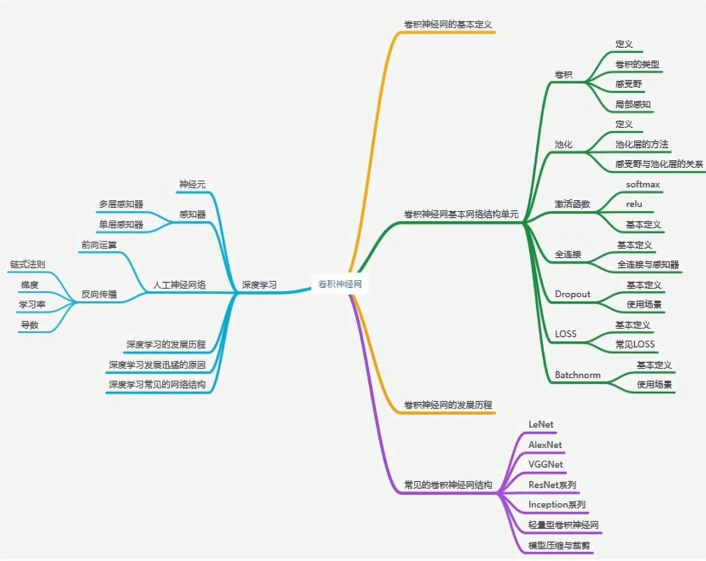
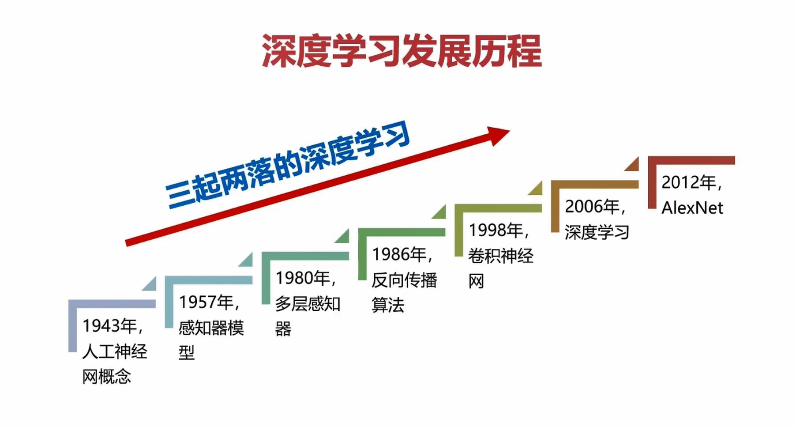
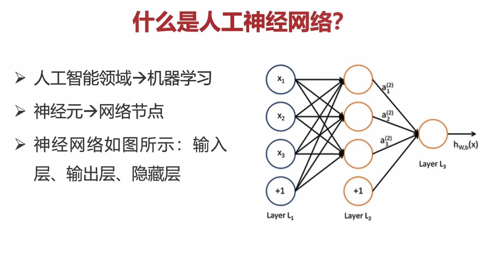
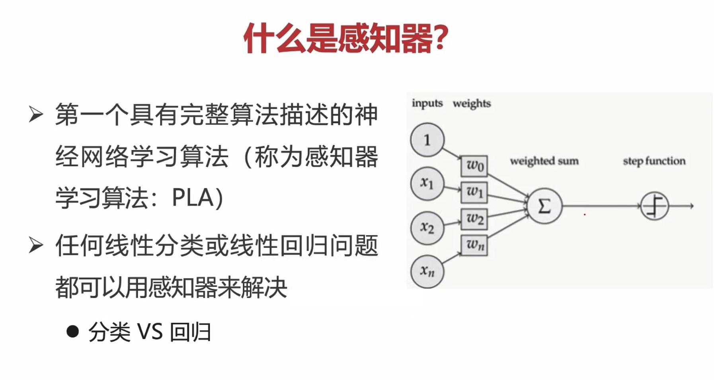
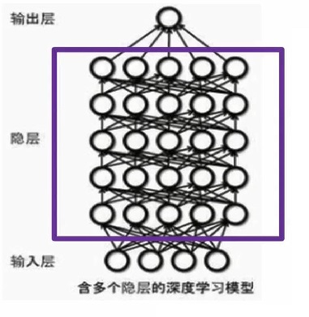
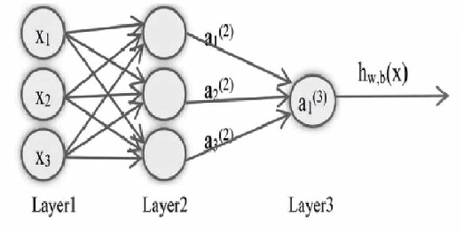
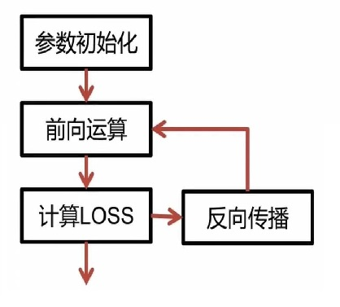

# 深度学习基础串讲

基于TensorFlow的人脸识别智能小程序的设计与实现 深度学习基础串讲

<!--more-->

## 1 内容概况（卷积神经网）

## 2 深度学习相关概念

### 2.1 深度学习发展历程

### 2.2 人工神经网络

### 2.3 感知器

多层感知器（MLP）也叫人工神经网络（ANN）

### 2.4 深度学习

含`多隐层的多层感知器`就是一种深度学习结构

### 2.5 神经元 -> 感知器 -> 神经网络 -> 深度学习

* 多层感知器 -> 神经网络
* 多隐层的多层感知器 -> 深度学习

## 3 深度学习相关理论

### 3.1 深度学习中的核心知识

#### 3.1.1 前向运算（怎么用？）

计算输出值得过程称为`前向运算`

#### 3.1.2 反向传播（怎么学？）

##### 1. 神经网络（参数模型）训练方法

* 1986年由Rumelhar和Hinton等人提出
* 解决神经网络优化问题
* 计算输出层结果与真实值之间的偏差来进行逐层调节参数

##### 2. 神经网络参数训练是一个不断迭代的过程

##### 3. 参数更新多少？

* 参数优化的问题
* 导数和学习率

#### 3.1.3 梯度下降算法

* 沿着导数下降的方法，进行参数更新
* 选择合适的步长/学习率
* 局部最优解

### 3.2 深度学习发展迅猛的原因

* 数据：imageNet
* 算力：GPU+深度学习芯片
* 算法：分类、检测、分割等

## 4 常见的深度学习模型

* 卷积神经网（CNN）
* 循环神经网（RNN）
* 自动编码机（Autoencoder）
* Restricted Boltzmann Machines（RBM，受限玻尔兹曼机）
* 深度信念网络（DBN，Deep Belief Network）
