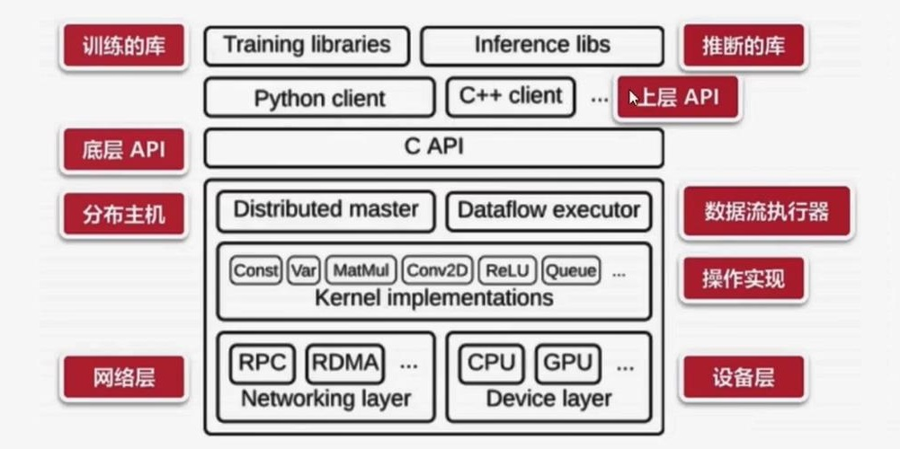
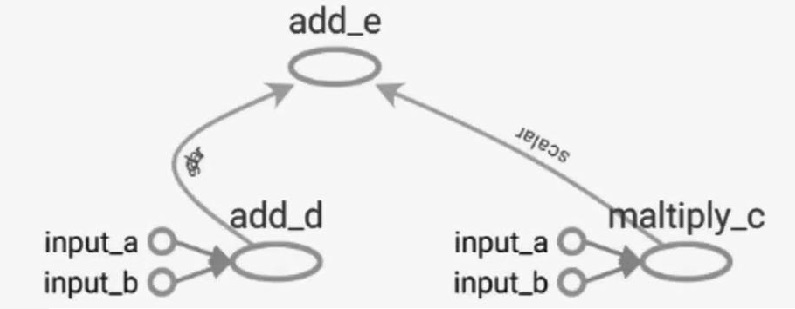
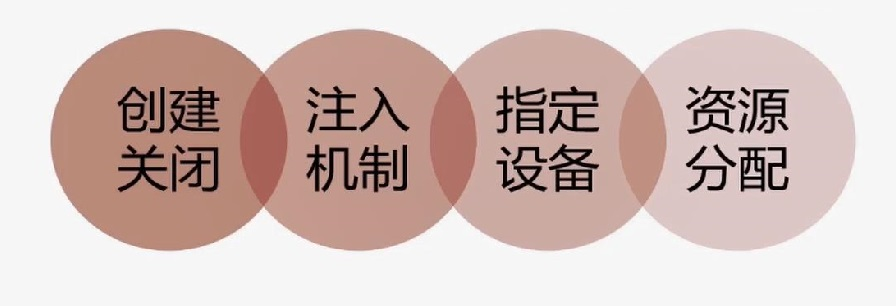

# TensorFlow基础串讲


基于TensorFlow的人脸识别智能小程序的设计与实现 TensorFlow基础串讲

<!--more-->
## 1 什么是TensorFlow？

* Google开源的基于数据流图的科学计算库，适合用于机器学习、深度学习等人工智能领；
* <https://github.com/tensorflow>
* <https://github.com/tensorflow/models>
* Tensor(张量、数据)+Flow（数据流、数据流向）=TensorFlow（整个数据按一定的方向流动，在流动的同时需要进行一系列的运算）

## 2 TensorFlow的架构

* 前端：编程模型、构造计算图、Python、C++、Java（计算图的设计）
* 后端：运行计算图、C++（计算图的搭建）



## 3 TensorFlow的优点

* 高度的灵活性（支持非常原子的操作，比如 `+`、`-`、`*`、`/` 、与或非等基本运算，提供了非常丰富的API接口）
* 真正的可移植性（底层采用C实现）
* 将科研与产品联系在一起（采用TensorFlow进行的科研模型可以直接用在产品上）
* 自动求微分
* 多语言支持（Python、C++、Java）
* 性能最优化（由Google维护）
* 社区内容丰富（Github收藏量远远高于其他深度学习模块）

## 4 TensorFlow中的基本概念

### 4.1 Graph

图描述了计算的过程，可以通过tensorboard图形化流程结构
* 声明（单个/多个）
* 保存为pb文件（包括网络结构和网络参数）
* 从pb中恢复Graph
* TensorFlow可视化  



```Python
#声明
g = tf.Graph()
g = tf.get_default_graph()
g = tf.constant(0)
g = x.graph

#如何声明和交叉使用多个Graph？
g1 = tf.Graph()
with g1.as_default():
    x1 = tf.constant(1.0,name="x1")
    
g2 = tf.Graph()
with g2.as_default():
    x2 = tf.constant(2.0,name="x2")
    
with tf.Session(graph=g2) as sess1:
    x1_list = tf.tf.import_graph_def(g1.as_graph_def,
            return_elements = ["x1:0"],name = "")
    print(sess_1.run(x1_list[0] + x2)))
    
#保存pb
g1 = tf.Graph()
tf.train.write_graph(g1.as_graph_def(),'.','graph.pb',False)

#从pb中恢复Graph
#load graph
with gfile.FastGFile("graph.pb",'rb') as f:
    graph_def = tf.GraphDef()
    graph_def.ParseFromString(f.read())
    tf.import_graph_def(graph_def,name='')
    
sess = tf.Session()
c1_tensor = sess.graph.get_tensor_by_name("c1:0") #获取计算图的节点
c1 = sess.run(c1_tensor) #计算计算图相应节点的值

#使用tensorboard可视化计算图结构
import tensorflow as tf
a = tf.constant(1,name='input a') #定义常量
b = tf.constant(2,name='input b')
c = tf.multiply(a,b,name='maltiply_c')
d = tf.add(a,b,name='add_d')
e = tf.add(d,c,name='add_e')
sess = tf.Session()
sess.run(e)
writer = tf.summary.FileWriter('graph',sess.graph)
```

### 4.2 Session

* 图必须在称之为“会话”的上下文中执行。
* 会话将图的op（操作）分发到诸如CPU或GPU之类的设备上执行。
* 前段和后端的沟通，起到桥梁的作用 



```Python
#创建和关闭会话
sess = tf.Session() #常用
sess = tf.InteractiveSession() #交互式，对交互性要求比较高的脚本中，希望实时看到脚本运行的结果
with tf.Session() as Sess: #定义Session的作用域，和sess = tf.Session() 等价
...
sess.close()

#注入机制,完成计算图的运算，桥梁作用
sess.run(...)
sess.run(tf.global_variables_initializer())

a = tf.placeholder(dtype=tf.float32)
b = tf.placeholder(dtype=tf.float32)
add = a + b
add_val = sess.run(add,feed_dict={a:1,b:2}) 

#制定资源设备
a = tf.placeholder(dtype=tf.float32) 
b = tf.placeholder(dtype=tf.float32) 
add = a + b
with tf.Session() as sess:
    with tf.device("/cpu:0")
        print(sess.run(ass,feed_dict = {a:1,b:1}))
        
#资源分配-控制GPU资源使用率
config = tf.ConfigProto()
config.gpu_options.allow_growth = True  #按需分配
session = tf.Session(config=config,...)
```

### 4.3 Tensor 

* 在TensorFlow中，所有在结点之间传递的数据都为Tensor对象
* N维数组，图像：`（batch*height*width*channel）`

```Python
#Tensor的定义
#tf.constant() 常量
cons = tf.constant(value=[1,2],dtype=tf.float32,shape=(1,2),name='testconst',verify_shape=False)
#                  取值         类型             形状        名称              形状是否可以改变

#tf.Variable() 变量
W = tf.Variable(tf.zeros([3,10]),dtype=tf.float64,name='W')

#tf.placeholder() 占位符
X = tf.placeholder(dtype=tf.float32,shape=[144,10],name='X')
X = tf.placeholder(dtype=tf.float32,shape=[None,None],name='X')

#tf.SparseTensor() 稀疏的张量        
```

### 4.4 Operation

* TensorFlow Graph 中的计算节点，输入输出均为Tensor
* 调用`Session.run(tensor)`或者`tensor.eval()`方可获取该Tensor的值

### 4.5 Feed

通过feed为计算图注入值

```Python
a = tf.placeholder(tf.float32)
b = tf.placeholder(tf.float32)
c = tf.add(a,b)
with tf.Session() as sess:
    result = sess.run(c,feed_dict={a:3,b:4})
    print(result) 
```
## 5 TensorFlow在深度学习中使用的API

```Pythontf.expand_dims(input,dim,name=None)
tf.split(split_dam,num_split,value,name='split')
tf.concat(concat_dim,values,name='concat')
tf.cast()
tf.reshape()
tf.equal()
tf.matmul(a,b)
tf.argmax()
tf.squeeze()
#tf.nn
tf.nn.conv2d
tf.nn.max_pool
tf.nn.avg_pool
tf.nn.relu
tf.nn.dropout
tf.nn.l2_normalize
tf.nn.batch_normalization
tf.nn.l2_loss
tf.nn.softmax_cross_enyropy_with_logits
#tf.train
tf.train.Saver.save
tf.train.Saver.restore
tf.train.GradientDescentOptimizer(0.01).minimize(loss)
tf.train.exponential_decay(1e-2,global_step,decay_steps=sample_size/batch,decay_rate=0.98,staircase=True)
tf.train.string_input_producer(filenames,num_epochs=num_epochs,shuffle=True)
tf.train.shuffle_batch([example,lable],batch_size=batch_size,capacity=capacity,min_after_dequeue=min_after_dequeue)
tf.train.Coordinator
tf.train.start_queue_runners(sess=sess,coord=coord
```

## 6 TensorFlow中的数据操作

TensorFlow提供了`TFRecord`的格式来统一存储数据

### 6.1 TFRecord

TFRecord将图像数据和标签放在一起的二进制文件（protocol buffer），能更好的利用内存，实现快速的复制，移动， 读取，存储
* 数据读取：`tf.train.string_input_producer`
* 数据解析：`tf.TFRecordReader、tf.parse_single_example`
* 数据写入：`tf.python_io.TFRecordWriter`

### 6.2 数据写入相关的API方法

```Python
writer = tf.python_io.TFRecordWriter()
example = tf.train.Example()
writer.close()
writer.writer(example.SerializeToString())
```

### 6.3 数据读取相关的API方法

* 直接从文件中读取图片
* 从TF-Record中解析打包的图片数据

```Python
tf.train.string_input_producer、tf.train.slice_input_producer
tf.data库（动态图机制）
```

## 7 TensorFlow在深度学习中高级封装

### 7.1 TensorFlow在深度学习中使用的API

```Python
#slim
slim layers
slim.arg_scope
slim.data
slim evaluation
slim learning
slim losses
slim nets
slim variables
slim metrics
```

### 7.2 slim.arg_scope

`arg_scope(list_ops_or_scope,**kwargs)`
* `list_ops_or_scope`:操作列表或作用域列表
* `kwargs`: 参数，以keyword=value方式显示

```Python
net = slim.conv2d(inputs,64, [11, 11],4,
                    padding='SAME',
                    weights_initializer=
                    tf.truncated_normal_initializer (stddey=0.01)，
                    weights_regularizer=
                    slim.12_regularizer(0.0005),scope='convl')
with slim.arg_scope ([slim.conv2d],padding='SAME',
                    weights_initializer=
                    tf.truncated normal initializer(stddev=0.01)
                    weights_regularizer=
                    slim.12_regularizer(0. 0005)):
    net = slim.conv2d (inputs, 64,[11， 11], scope='conv1')
    net = slim.conv2d (net, 128,[11， 11], padding='VALID', scope= 'conv2')
    net = slim.conv2d(net， 256,[11， 11], scope= 'conv3')
```

### 7.3 BatchNorm层使用技巧

```Python
#slim.batch_norm()函数
    normalizer_fn = slim.batch_norm
    normalizer_params = batch_norm_params
#batch_norm_params
    'is_training':is_training,
    'zero_debias_moving_mean':True,
    'decay':batch_norm_decay,
    'epsilon':batch_norm_epsilon,
    'scale':batch_nrom_scale,
    'updates_collections':tf.GraphKeys.UPDATE_OPS,
    
with slim.arg_ scope(
    [slim.conv2d],
    weights_regularizer=slim.12_regularizer(weight_decay),
    weights_initializer=slim.variance_scaling_initializer(),
    activation_fn=tf.nn.relu,
    normalizer_fn=slim.batch_ norm,
    normalizer_params=batch_norm_params) :
        with slim.arg_scope([slim.batch_norm], **batch_norm_params ):
            with slim.arg_scope([slim.max_pool2d], padding='SAME') as arg_SC:
                return arg_SC
                
update_ops = tf.get_collection(tf.GraphKeys.UPDATE OPS)
    with tf.control_dependencies(update_ops):
        train step = tf.train.
            GradientDescentoptimizer (0.01).
            minimize (total_loss)

batchnorm updates = tf.get_collection (UPDATE_OPS_COLLECTION)
batchnorm updates_op = tf.group (*batchnorm_updates)
```

### 7.4 slim net

```Python
from tensorflow.contrib.slim.python.slim.nets import alexnet
from tensorflow.contrib.slim.python.slim.nets import inception
from tensorflow.contrib.slim.python.slim.nets import oxerfeat
from tensorflow.contrib.slim.python.slim.nets import resnet_utils
from tensorf1ow.contrib.slim.python.slim.nets import resnet_v1
from tensorflow.contrib.slim.python.slim.nets import resnet_v2
from tensorflow.contrib.slim.python.slim.nets import ygg
```

### 7.5 slim loss

* 经验风险小
	* 分类损失
	* 平方损失
	* 等等

* 正则化LOSS
	* 变量的L2正则化约束

```Python
weights_ regularizer = slim.12 regularizer (0.0005) )
loss_val = tf.nn.12_loss (var)
regularization_loss = tf.add_n(
    slim.losses.get_regularization_losses()
)
total_loss1 = classification_loss +
                    sum_of_squares_loss + pose_loss
                    + regularization_loss
slim.losses.add_loss(pose_loss)
total_loss2 = slim.losses.get_total_loss()
```

### 7.6 slim learn

* 梯度/学习率/BP
	* 学习率更新
	* 优化函数
	* 等等
* 学习率

```Python
tf.train.piecewise_constant 分段常数衰减
tf.train.inverse_time_decay 反时限衰减
tf.train.polynomial_decay 多项式衰减
tf.train.exponential_decay 指数衰减
...
```

### 7.7 slim metrics

TF-Slim提供了一系列度量操作，使评估模型变得简单
* `value_ op`是一个幂等操作，返回度量的当前值。
* `update_ op`是执行上述聚合步骤以及返回度量值的操作。

```Python
mae_ value_ op, mae_ update _op =
    slim.metrics.streaming_mean_absolute_error(
        predictions, labels
        )
```

### 7.8 slim ecaluation

* TF-Slim提供一个评估模块`evaluation.py`，其中包含用于使用`metric_ ops.py`模块中的指标编写模型评估脚本的帮助

```Python
slim.evaluation.evaluation_1oop(
    'local',
    checkpoint_dir,
    1og_dir,
    num_evals=num batches,
    eval_op=names_to_updates.values(),
    summary_op=tf.summary.merge(summary_ops),
    eval_interval secs=eval_interval_secs)
```

* 函数: `evaluation_ loop`、`evaluation once`

### 7.9 slim data

* `slim.data`包 下面有很多对数据的操作方法
* 在`slim._init_`中有如下几种:

```Python
from tensorflow.contrib.slim.python.slim.data import data_decoder
from tensorflow.contrib.slim.python.slim.data import data_provider
from tensorflow.contrib.slim.python.slim.data import dataset
from tensorflow.contrib.slim.python.slim.data import dataset_data_provider
from tensorflow.contrib.slim.python.slim.data import parallel_reader
from tensorflow.contrib.slim.python.slim.data import prefetch_queue
from tensorflow.contrib.slim.python.slim.data import tfexample_decoder
```
## 8 TensorFlow常见的数据增强方法

### 8.1 tf.image库进行数据增强

* 颜色扰动(亮度、对比度、HSV、 RGB等)
* 裁剪/Pad
* 噪声/模糊
* 翻转/旋转(空间几何变换/放射变换)
* Draw Boxes
* 标准化

### 8.2 其他数据增强的方法

* Mixup
* Oversampling
* 锐化/浮雕/灰度
* 边界检测
* 超像素
* 255-V

```Python
"""图像亮度[-1, 1]"""
# img_data = tf.image.adjust_brightness(img_data, delta=-.7) 
"""随机图像亮度"""
# img_data = tf.image.random_brightness(img_data, max_delta=0.6)
"""随机对比度"""
# img_data = tf.image.random_contrast(img.data, lower=0, upper=4)
"""随机色调"""
# img_data = tf.image.random_hue(img. data, 0.5)
"""随机饱和度"""
# img_data = tf.image.random_saturation(img_data, lower=0, upper=2)
"""图片标准化 (x-mean) / max(stddev, 1.0/sqrt(image.NumElements()))"""
# img_data = tf.image.per_image_standardization( img.data)
```

## 9 Tensorboard使用介绍

### 9.1 Tensorboard可以进行网络可视化/训练中间结果可视化

```Bash
pip3 install tensorboard
tensorboard --logdir logs
#Scalars/Graph/lmage/Histogram/Distributions
```

### 9.2 tf.summary

```Python
writer = tf.summary.FileWriter("logs/", sess.graph)
tf.summary.histogram'bias',bias)
tf.summary.scalar('loss',loss)
tf.summary.image( 'image',image)
    merged = tf.summary.merge_all()
    rs=sess.run(merged)
    writer.add_summary(rs,step)
```
