# 人脸匹配业务理论及实现


基于TensorFlow的人脸识别智能小程序的设计与实现 人脸匹配业务理论及实现

<!--more-->

## 1 人脸匹配业务介绍

* 1:1 验证， verification
* 1:N 识别， identification

## 2 人脸匹配算法性能评价指标

* 人脸验证：ROC曲线、PR曲线
* 人脸识别：CMC曲线  

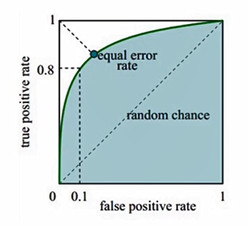

### 2.1 CMC曲线

* 累积匹配曲线
* Top1 error 预测出来最大概率的那个分类是正确的概率。
* Top5 error 预测出来最大概率的5个分类里有正确的概率。

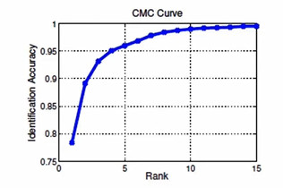

## 3 人脸匹配方法介绍

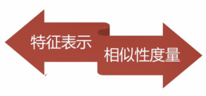

### 3.1 人脸特征表示问题

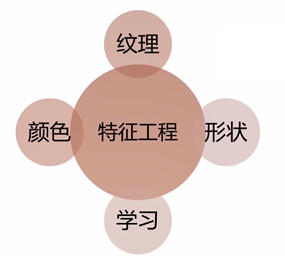

* 颜色：一般输出一个向量，通常为一个直方图
* 纹理：对颜色矩阵差分可以得到纹理特征
* 形状：对图像中的结构信息进行分解
* 学习：对以上三种人为设计的基本信息进行学习，加入监督信息、类别信息等，更加鲁棒
{}
如何进行特征表示的优化学习？
* PCA（无监督）	
	* 对高维的稠密的可以通过PCA进行特征降维，提取主成分
* LDA（有监督）
	* 优化特征空间
* 迁移学习
	* 对于空间上存在不同分布的两种样本，指向同一个投影（Common Subspace）
* 稀疏表示（Deep Learning之前的一代技术）
	* 多用于信号分解、图像降噪等领域，用较少的基本信号的线性组合来表达大部分或者全部的原始信号
* 低秩学习（low-rank）
	* 图像数据具有局部相似性，可能存在“一一表示”，从而矩阵就可能不是满秩
* 哈希学习
	* 哈希函数可以是基于线性的、核函数、球面函数、深度神经网络、无参函数
	  通过机器学习机制将数据映射成简洁的二进制串的形式, 
	  同时使得哈希码尽可能地保持原空间中的近邻关系, 即保相似性
{}

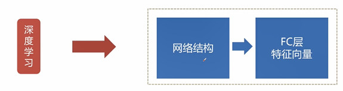

### 3.2 人脸特征度量问题

#### 3.2.1 什么是度量问题？

* A和B同类，A和C不同类
* A和B的相似性大于A和C的相似性
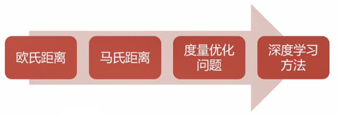

#### 3.2.2 欧氏距离（Euclidean Distance）

* 欧氏距离是最常见的距离度量，衡量的是多维空间中各个点之间的绝对距离。
* 如点$x=(x_1,…,x_n)$和$y=(y_1,…,y_n)$之间的距离为：
$$ d(x,y)=\sqrt{\displaystyle\sum_{i=1}^n(x_i - y_i)^2} $$

#### 3.2.3 马氏距离（Mahalanobis Distance）

* 是由马哈拉诺比斯（P. C. Mahalanobis）提出的，表示数据的协方差距离。
它是一种有效的计算两个未知样本集的相似度的方法。
* 与欧氏距离不同的是它考虑到各种特性之间的联系,
并且是尺度无关的（scale-invariant），即独立于测量尺度。
* 对于一个均值为$μ=(μ_1,μ_2,μ_3,...,μ_p)^T$协方差矩阵为$S$的多变量$x=(x_1,x_2,x_3,...,x_p)^T$其马氏距离为：
$$D_M(x)=\sqrt{(x−μ)^TS^{-1}(x−μ)}$$

#### 3.2.4 度量优化问题

* 对解空间加不同的约束，在很大的假设空间中找出合适的解，缩小解空间。

## 3.3 人脸匹配的深度学习方法 

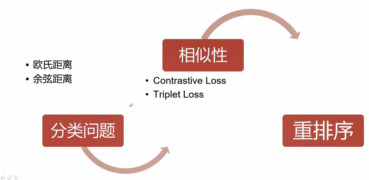

{}
* 分类问题的网络是单支的
	* 进行人脸特征匹配时，用欧氏距离和余弦距离来测量当前提取出来的特征向量，特征向量利用网络进行学习
	* 样本量非常丰富，单类样本样本数量非常多时，通常采用分类网络
* 相似性的网络是多分支的
	* 通过多分支网络对输入的样本进行改造，根据样本id设计不同的Loss
	* 2分支采用 Contrastive Loss 
	* 3分支采用 Triplet Loss
	* 利用两种不同的Loss提取出特征，提取的特征具有鉴别信息（同类之间相似性很小，不同类之间相似性很大）
	* 通常采用欧氏距离进行Loss的计算
	* 多分支网络在进行特征表示时，会进行不同分支间参数共享，网络收敛后，去除其中一只来提取特征，以此提取出特征向量
	* 样本量比较少，单类样本数量也比较少时，通常采用多分支网络结构
* 重排序（ReRank）
	* 利用深度学习网络提取完特征，并对特征进行了相似性度量和排序后，根据排序结果再次重新排序
{}

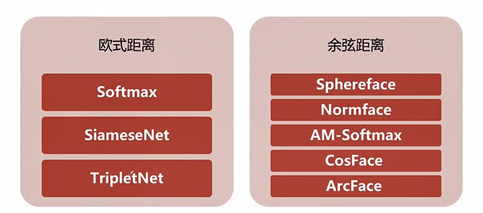

## 4 FaceNet编程实战及模型优化

### 4.1 FaceNet模型详细介绍

#### 4.1.1 Learn to rank

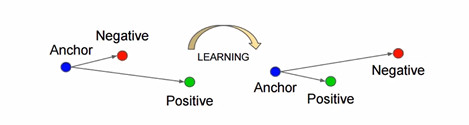

{}
* Anchor和Positive为同类样本
* 经过学习之后，同类样本之间的相似度更高（距离更小）
{}	

#### 4.1.2 网络结构

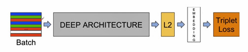

{}
* FaceNet也可称为Triplet Net的一个网络结构
* Batch由多个三元组构成，包含样本对(Anchor,Positive,Negative)
* DEEP ARCHITECTURE 深度网络主干网络（标准卷积神经网），对输入的图像进行特征提取，将图片转化成向量
* 对提取出来的向量通过L2进行归一化
* 得到归一化后的EMBEDDING（最终的特征向量）
* EMBEDDING作为 Triplet Loss 的输入，输入同样为三元组(Anchor的特征向量,Positive的特征向量,Negative的特征向量)
{}

#### 4.1.3 Loss设计

$$\displaystyle\sum_{i=1}^N[\text{\textbardbl}f(x{_i^a})-f(x{_i^p})\text{\textbardbl}{_2^2}
-\text{\textbardbl}f(x{_i^a})-f(x{_i^n})\text{\textbardbl}{_2^2}+\alpha]_+$$

{}
* N个三元组
* (Anchor-Positive)-(Anchor-Negative) 得到同类和不同类之间的样本距离差
* α为间隔，通过α可以调节同类样本和不同类样本之间的距离满足多大的距离差才能算作一个样本
* 通过Loss的设计学出来的特征可以用来度量样本的相似度
* 计算向量相似度时采用的是二范式，即欧氏距离
* 利用FaceNet进行特征向量提取，计算样本相似度时只采用欧氏距离即可
{}

#### 4.1.4 难例挖掘

* OHEM

{}
* 难例挖掘是指,针对模型训练过程中导致损失值很大的一些样本(即使模型很大概率分类错误的样本),重新训练它们.
* 维护一个错误分类样本池, 把每个batch训练数据中的出错率很大的样本放入该样本池中,当积累到一个batch以后,将这些样本放回网络重新训练.
* 在进行Loss计算时，主要考虑难例，对简单样本不计算Loss
{}

#### 4.1.5 数据增强

* 颜色信息、几何变换、GAN、多样本数据增强
{}
* 数据增强也叫数据扩增，意思是在不实质性的增加数据的情况下，让有限的数据产生等价于更多数据的价值。
* 颜色信息常包括：噪声、模糊、颜色变换、擦除、填充等。
* 几何变换常包括：翻转，旋转，裁剪，变形，缩放等。
* GAN包含两个网络，一个是生成网络，一个是对抗网络，基本原理如下：
	* G是一个生成图片的网络，它接收随机的噪声z，通过噪声生成图片，记做G(z) 。
	* D是一个判别网络，判别一张图片是不是“真实的”，即是真实的图片，还是由G生成的图片。
	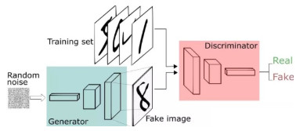
* 多样本数据增强不同于单样本数据增强，多样本数据增强方法利用多个样本来产生新的样本。
{}

### 4.2 FaceNet环境搭建
{}

* 源码地址：
	* <https://github.com/davidsandberg/facenet>
	* TensorFlow1.12、Ubuntu16.04、Python3.5
	* <https://github.com/VisualComputingInstitute/triplet-reid>
{}

```Bash
#下载FaceNet
git clone https://github.com/davidsandberg/facenet
# 进入facenet目录下
cd facenet
#修改 requirements.txt 将tensorflow==1.7注释掉，保存
gedit requirements.txt
# 下载需要的依赖库
sudo pip3 install -r requirements.txt
#安装完成
```

### 4.3 人脸匹配数据准备

#### 4.3.1 常见数据集

* [LFW](http://vis-www.cs.umass.edu/lfw/)
	* LFW人脸数据库主要用来研究非受限情况下的人脸识别问题,主要测试人脸识别的准确率。
* [Celeba](http://mmlab.ie.cuhk.edu.hk/projects/CelebA.html)
	* CelebA由香港中文大学开放提供，广泛用于人脸相关的计算机视觉训练任务，可用于人脸属性标识训练、人脸检测训练以及landmark标记等。
* [VGGface2](http://zeus.robots.ox.ac.uk/vgg_face2/signup/)
	* VGGFace2 是一个大规模人脸识别数据，包含331万图片，9131个ID，平均图片个数为362.6。
* CASIA-WebFace
	* CASIA-WebFace数据集包含了10575 个人的494414 张图像。CASIA-webface数据库，压缩包有4个多g，里面包含了10000个人，一共50万张人脸图片，无论是做SVM，DNN还是别的训练，都是非常好的数据库。
* [CASIA-faceV5](http://biometrics.idealtest.org/dbDetailForUser.do?id=9)
	* 亚洲人脸数据库

#### 4.3.2 数据格式

* 文件夹名/文件夹名_文件名
* 同一个人的图片放在相同文件夹	

#### 4.3.3 人脸匹配数据准备

##### 1.方法一

```Bash
#下载FaceNet源码
git clone https://github.com/davidsandberg/facenet
# 进入facenet目录下
cd facenet
#安装所需依赖库
sudo pip3 install -r requirements.txt
#添加环境变量
export PYTHONPATH=$(pwd)/src
#人脸对齐脚本 -> 将图片裁剪成160*160的人脸图片
python3 src/align/align_dataset_mtcnn.py lfw lfw_160--image_size 160 --margin 32 --random_order -- gpu_memory_fraction 0.25
```	

##### 2.方法二
* dlib库用来进行人脸检测+关键点定位
* 根据关键点或者人脸检测结果，提取人脸图像

##### 3.通过mtcnn完成人脸匹配数据准备	
	
## 5 实例代码
### 5.1 数据集处理
在使用FaceNet框架进行人脸匹配模型训练时，需要将数据转换为FaceNet要求的数据格式，同一个人的不同图片存放在同一个文件夹下，数据格式为：“文件夹名/文件夹名_文件名”。在FaceNet中不需要额外的将数据打包为`tfrecord`格式，如果与要求的格式一致，FaceNet框架会自动解析数据。

LFW数据集的处理：在使用FaceNet框架时需要将图片裁剪到`160*160`，系统使用FaceNet自带的`align_dataset_mtcnn.py`脚本对LFW数据集中的人脸图片进行处理。命令和参数的配置如下：

```Bash
python3 src/align/align_dataset_mtcnn.py /mnt/dataset/LFW  /mnt/dataset/LFW-160  --image_size 160 --margin 32  --random_order  --gpu_memory_fraction 0.25
```

CASIA-FaceV5亚洲人脸数据集的处理：使用dlib库创建人脸检测器，利用人脸检测器对数据集中的图片依次进行检测，将未检测出人脸的图片过滤掉，成功检测出人脸的图片先获取到检测出的人脸位置，对检测出的人脸框进行扩充，这样做可以保证获取到的人脸是一张完整的人脸，根据扩充后的坐标将图片裁剪为160 * 160大小，裁剪后的图片根据不同的人存储到相对应的文件夹下，主要代码如下：

```Python
for idx_folder in im_folder_list:
    im_items_list = glob.glob(idx_folder + "/*")
    if not os.path.exists("{}/{}".format(crop_im_path, idx)):
        os.mkdir("{}/{}".format(crop_im_path, idx))
    idx_im = 0
    for im_path in im_items_list:
        im_data = cv2.imread(im_path)
        dets = detector(im_data, 1)
        if dets.__len__() == 0:
            continue
        d = dets[0]
        # 获取人脸坐标
x1 = d.left()
        y1 = d.top()
        x2 = d.right()
        y2 = d.bottom()
        # 对识别出的人脸进行扩充
        y1 = int(y1 - (y2 - y1) * 0.3)
        x1 = int(x1 - (x2 - x1) * 0.05)
        x2 = int(x2 + (x2 - x1) * 0.05)
        y2 = y2
        im_crop_data = im_data[y1:y2,x1:x2]
        im_data = cv2.resize(im_crop_data, (160, 160))
        im_save_path = "{}/{}/{}_{}.jpg".format(crop_im_path, idx, idx, "%04d" % idx_im)
        cv2.imwrite(im_save_path, im_data)
        idx_im += 1
    idx += 1
```
### 5.2 模型训练
人脸匹配模型训练采用FaceNet提供的`train_tripletloss.py`脚本，在使用`tripletloss`训练时，需要修改数据的存放路径，其余参数采用默认参数，相关代码如下：
```
    parser.add_argument('--data_dir', type=str,
        help='Path to the data directory containing aligned face patches.',
        default='/mnt/dataset/64_CASIA-FaceV5/crop_image_160'
                '')
```
模型训练中loss曲线如下图所示:
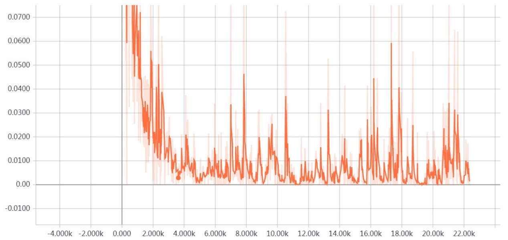

### 5.3 模型固化	
FaceNet提供了`freeze_graph.py`脚本，来进行模型固化。脚本运行需要两个参数，`model_dir`是训练好的模型的路径，`output_file`是固化好的pb文件的输出路径。
### 5.4 模型测试
使用FaceNet中提供得`validate_on_lfw.py`脚本，利用经过处理的LFW数据集对训练好的模型进行测试。该脚本使用auc实现对算法性能的评价。在使用该脚本时，需要传入两个参数，一个是处理好的LFW数据集的路径，一个是训练好的模型的路径。
测试得到的数据如下图所示：
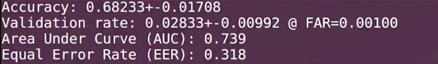


## 6 参考资料

{}
* [《机器学习》第10章 降维与度量分析](https://www.jianshu.com/p/db8f15c3fe56)
* [【技术综述】深度学习中的数据增强方法都有哪些？](https://zhuanlan.zhihu.com/p/61759947)
* [face recognition[翻译][深度人脸识别:综述]](https://www.cnblogs.com/shouhuxianjian/p/9789243.html)
* [NanoNets :数据有限时如何应用深度学习？](https://baijiahao.baidu.com/s?id=1599774773742858032&wfr=spider&for=pc)
* [数据增强：数据有限时如何使用深度学习 ？](https://www.leiphone.com/news/201805/avOH5g1ZX3lAbmjp.html)
* [LFW人脸数据库的简介](https://blog.csdn.net/qq_41185868/article/details/82915063)
* [CelebA数据集详细介绍及其属性提取源代码](https://zhuanlan.zhihu.com/p/35975956)
* [性别年龄论文阅读（3）——VGGFace2](https://blog.csdn.net/heruili/article/details/88208757)
* [Dataset之CASIA-WebFace](https://blog.csdn.net/qq_41185868/article/details/82925992)
{}
