# 人脸对齐/关键点训练业务理论及实现


基于TensorFlow的人脸识别智能小程序的设计与实现 人脸对齐/关键点训练业务理论及实现

<!--more-->

## 1 人脸对齐/关键点业务介绍


* 根据输入的人脸图像，自动定位出面部特征关键点，如眼睛、鼻尖、嘴角点、眉毛以及人脸各部件轮廓点等  
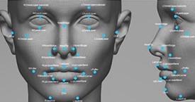

* 2D人脸
* 3D人脸
* 关键点数量：5,21,29,68,96,192......
* 旷视科技`1000`点与`8000`点对比如下图  

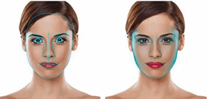

* 表情识别、人脸编辑、人脸美妆、三维重建

## 2 人脸关键点算法评价指标

### 2.1 通常将输出结果表示成点的集合，再进一步表示成向量

### 2.2 NME：Normalized mean error

* 两外眼角间距离
* 人脸外接矩阵对角线长度
$$ e = \frac{\textstyle\sum_{i=1}^n \Vert X_{(i)}^e-X_{(i)}^e \Vert_2}{N * d_{io}}$$

### 2.3 CED：Cumulative Errors Distribution（CED）curve

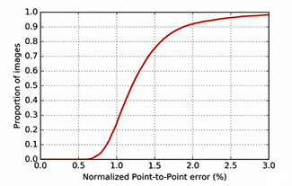

* 横坐标表达当前的偏差值
* 纵坐标表达满足当前偏差值得图片的数量

## 3 人脸关键点方法介绍

### 3.1 传统方法

#### 3.1.1 形状学习

* 基于形状学习的模型：ASM、AAM
* 基于形状学习的人脸关键点流程 

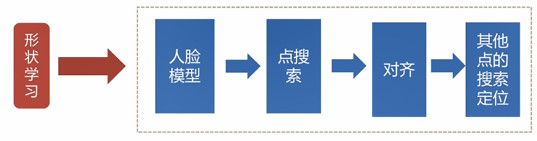

{}
* 主要作用：勾勒出人脸基准点的轮廓，轮廓属于特定的形状。
* 人脸模型：对人脸特征点进行建模，首先选择基准图片，利用基准图片作为参照，
将训练集的图片按照基准进行变换，得到训练集的图像处理后的集合，
对训练集中人脸关键点标定的位置，对每一个点进行特征提取，以当前关键点为中心，
提取它的局部的图像区域进行特征提取，假设特征提取后有5个点，就会得到5个向量。
* 点搜索：给定一个测试集的图片，进行关键点的搜索，
初步搜索时选择5个点中的某几个点作为最开始搜索的对象，通常选择眼睛或鼻子。
* 对齐：根据基准点对人脸进行对齐。
* 其他点的搜索定位：以基准点为参照，预测想要定位的其他的点的大致位置！
{}

#### 3.1.2 级联回归学习

* 基于级联回归学习的模型：CPR  

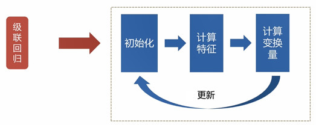

{}
* 对于人脸特征点定位，人脸关键点检测的目的是估计向量(Facial Shape) $S=(x_1,y_1,x_2,y_2,...,x_K,y_K)$ ，
其中 $K$ 表示关键点的个数，由于每个关键点有横纵两个坐标，所以 $S$ 的长度为 $2K$ 。 
对于一个输入 $I$ , 给定一个初始形状 $S^0$ (通常是在训练集计算得到的平均形状)。
每一级输出的是根据输入图像得到的偏移估计$\Delta S$，那么每一级都会更准确的预测
脸上Landmark的位置
$$S^{t+1 }= S^t+r_t(\phi(I,S^t))$$
其中，$S^t$ 和 $S^{t+1}$ 分别表示第 $t$ 和 $t+1$ 级预测的人脸形状(即所有关键点集合)，表示回归函数
* CPR通过一系列回归器将一个指定的初始预测值逐步细化，
每一个回归器都依靠前一个回归器的输出来执行简单的图像操作，
整个系统可自动的从训练样本中学习。
* CPR检测流程一共有T个阶段，在每个阶段中首先进行特征提取f，
这里使用的是shape-indexed features，
也可以使用诸如HOG、SIFT等人工设计的特征，
或者其他可学习特征（learning based features），
然后通过训练得到的回归器R来估计增量ΔS( update vector)，
把ΔS加到前一个阶段的S上得到新的S，这样通过不断的迭代即可以得到最终的S(shape)。
{}

> 推荐阅读文献  
> * Face Alignment at 3000 FPS via Regressing Local Binary Features(LBF)
> * Joint Cascade Face Detection and Alignment
> * One Millisecond Face Alignment with an Ensemble of Regresion Trees(ETR)
> * Face Alignment In-the-Wild: A Survey
> * Facial feature point detection: A comprehensive survey

### 3.2 深度学习方法  

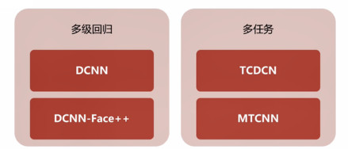

#### 3.2.1 多级回归

* DCNN
	* 总体思想是由粗到细，实现5个人脸关键点的精确定位。网络结构分为3层：level 1、level 2、level 3。每层都包含多个独立的CNN模型，负责预测部分或全部关键点位置，在此基础上平均来得到该层最终的预测结果。  
  
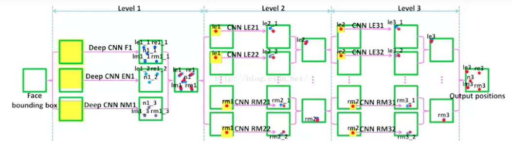

* DCNN-Face++

#### 3.2.2 多任务

* TCDCN
	* 使用与人脸相关的属性共同来学习人脸的特征点位置，通过这种多任务的学习，来提高人脸特征点检测的鲁棒性。具体而言，就是在人脸特征点检测时候，同时进行多个任务（包括性别、是否戴眼镜、是否微笑以及脸部姿势）的学习。使用这些辅助属性可以帮助更好的定位特征点。

* MTCNN
	* CNN回归和检测多任务，多尺度级联，三个网络级联，由粗到精，同时完成检测和特征点定位回归。 

#### 3.2.3 直接回归

* Vanilla CNN
	* 作者对网络不同层的特征进行使用GMM进行聚类分析，发现网络进行的是层次的，由粗到精(hierarchical, coarse to fine)的特征定位，越深的网络特征越能反应出特征点的位置。

#### 3.2.4 热图

* DAN
	* 与以往级联神经网络输入的是图像的某一部分不同，DAN各阶段网络的输入均为整张图片。当网络均采用整张图片作为输入时，DAN可以有效的克服头部姿态以及初始化带来的问题，从而得到更好的检测效果。之所以DAN能将整张图片作为输入，是因为其加入了关键点热图（Landmark Heatmaps），关键点热图的使用是本文的重要创新点。

#### 3.2.5 3D人脸关键点定位

* 2D人脸主要为可见点信息，对于侧脸很难训练
* 正脸到侧脸姿态变化较大，且标注十分困难

* 人脸本身就具有深度信息
	* Dense Face Alignment
	* DenseReg
	* FAN
	* 3DDFA
	* PRNet

## 4 人脸关键点常用数据集

| 数据集 | 个数 |
| ------ | ---- |
|[BiolD](https://bioid.com/About/BioID-Face-Database) |20|
|[LFPW](http://neerajkumar.org/databases/lfpw/)   |29|
|[AFLW](https://lrs.icg.tugraz.at/research/aflw/)|21|
|[COFW](http://www.vision.caltech.edu/xpburgos/)|29|
|[ICCV13/MVFW](https://sites.google.com/site/junliangxing/codes)|68|
|[OCFW](https://sites.google.com/site/junliangxing/codes)|68|
|[300-W](http://ibug.doc.ic.ac.uk/resources/300-W_IMAVIS/)|68|
|[HELEN](http://www.f-zhou.com/fa_code.html)|29|
|[CelebA](http://mmlab.ie.cuhk.edu.hk/projects/CelebA.html)|5|  
  
* 300W-LP
	* 68点
	* AFW,LFPW,HELEN,IBUG and XM2VTS  

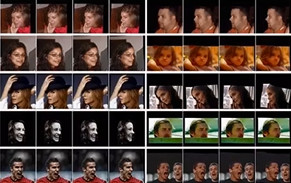

* Dlib库  
	* 能够检测出当前图片中的人脸的位置，并且完成人脸定位（68点），生成深度学习输入的训练样本。  


## 5 人脸关键点定位问题挑战及解决思路

|  问题  | 解决思路 |
| ------ | ---- |
|环境的变化|数据增强|
|姿态的变化|姿态分类、人脸对齐（矫正）|
|表情的变化|数据增强，GAN|
|遮挡问题|3D人脸关键点定位、优化主干网络|
|稠密点|3D人脸关键点定位、优化主干网络|
  
## 6 编程实战及模型优化

TensorFlow+SENet-人脸关键点定位编程实战及模型优化

### 6.1 TensorFlow+SENet模型详细介绍

* 人脸关键点网络结构
  


{}
* 数据：训练样本
* 网络结构：SENet
* 输出：预测人脸中的68个关键点，表示为`68*2=136`维的向量
* 回归网络
{}


* 网络结构
  
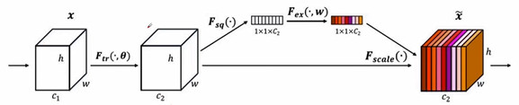

* SENet模型详细介绍  
  
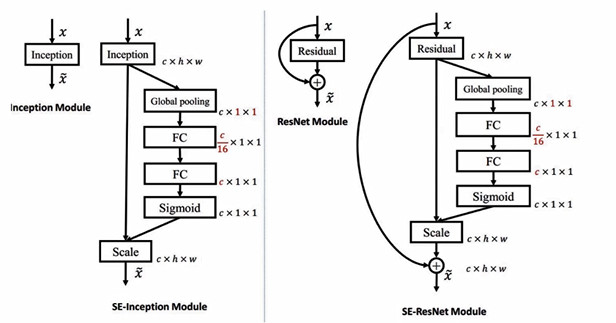

{}

* SE-Inception Module 是将SE模块嵌入到Inception结构的一个示例。方框旁边的维度信息代表该层的输出。
这里我们使用global average pooling作为Squeeze操作。紧接着两个Fully Connected 
层组成一个Bottleneck结构去建模通道间的相关性，并输出和输入特征同样数目的权重。
我们首先将特征维度降低到输入的1/16，然后经过ReLu激活后再通过一个Fully Connected 
层升回到原来的维度。这样做比直接用一个Fully Connected层的好处在于：
	* 具有更多的非线性，可以更好地拟合通道间复杂的相关性；
	* 极大地减少了参数量和计算量。然后通过一个Sigmoid的门获得0~1之间归一化的权重，最后通过一个Scale的操作来将归一化后的权重加权到每个通道的特征上。
* SE-ResNet Module 操作过程基本和SE-Inception一样，只不过是在Addition前对分支上
Residual的特征进行了特征重标定。如果对Addition后主支上的特征进行重标定，
由于在主干上存在0~1的scale操作，在网络较深BP优化时就会在靠近输入层容易
出现梯度消散的情况，导致模型难以优化。

```
X1 = conv(X0)
X2 = weight(X0)
X3 = X0 + X1 ** X2
```

{}

### 6.2 环境参数

{}
* Tensorflow1.12
* Ubuntu16.04
* Python3.5
{}

### 6.3 数据准备

{}
* 300W-LP
{}

## 7 实例代码

### 7.1 数据集处理

对landmark中的标注信息进行适当的调整，代码如下：

```Python
x_max = int(np.max(landmark[0:68, 0]))
x_min = int(np.min(landmark[0:68, 0]))
y_max = int(np.max(landmark[0:68, 1]))
y_min = int(np.min(landmark[0:68, 1]))
y_min = int(y_min - (y_max - y_min)  * 0.3)
y_max = int(y_max + (y_max - y_min)  * 0.05)
x_min = int(x_min - (x_max - x_min)  * 0.05)
x_max = int(x_max + (x_max - x_min)  * 0.05)
```

对数据进行裁剪，将人脸区域抠出来，获取人脸框的大小并对landmark数据进行标准化，将其归一化到`0~1`之间，对`x`,`y`的处理如下：

```Python
im_point.append((landmark[p][0] - x_min) * 1.0 / sp[1])
im_point.append((landmark[p][1] - y_min) * 1.0 / sp[0])
```
将图片的大小改变为`128*128`的大小，将整个数据集中80%的数据划分为训练集，剩余的20%划分为测试集。

### 7.2 模型训练

数据读取：定义`get_one_batch`函数，每次从中获取一个`batchsize`的数据，定义type=0时为训练集，读取`train.tfrecords`文件，`type=1`时为测试集，读取`test.tfrecords`。定义和读取文件队列，对训练集使用`shuffle_batch`获取队列中的数据，对测试集直接使用`batch`获取队列中的数据。定义`features`对读取出的数据进行解析，获取`features`中的`image`和`label`，接着将图像数据解码为`uint8`格式，对图像数据进行`reshape`并将其转换为`float型`。

定义网络结构：定义输入为`placeholder`，数据类型为`float32`，`shape`中`batch_size`定义为`None`，图像尺寸为`128 * 128 * 3`；模型共需要预测68个人脸关键点共136个点，将`label`的`shape`定义为`136`，具体代码如下：

```Python
input_x = tf.placeholder(tf.float32, shape=[None, 128, 128, 3])
label = tf.placeholder(tf.float32, shape=[None, 136])
logits = SENet(input_x, is_training=True, keep_prob=0.8)
```
SENet:定义`senet_blob(net, in_dim, on_dim, stride)`函数，其中`in_dim`为输入特征图通道数，`on_dim`为输出特征图通道数，`stride`表示当前网络是否进行下采样。对输入的张量进行备份，并进行卷积操作，对通道的数量进行适当的降维，第一次，降4倍，进行`1 * 1`的卷积，接着进行`3 * 3`的卷积，接着再进行1 * 1的卷积，得到与输出维度相同的卷积，对`stride大于1`的数据通道`poll2d`进行下采样。通过`reduce_mean`对1、2维度进行`average_pooling`，调用`slim.fully_connected`加入全连接层，加入激活层，再次加入全连接层，使用`sigomid`将权重映射到0,1之间，得到通道加权之后的网络结构，将得到的值与备份的张量相加，实现跳连部分。

定义好基本模块之后，开始搭建SENet网络结构，定义权重可选的正则化程序为`slim.l2_regularizer(0.00001)`、定义权重初始化程序为`slim.variance_scaling_initializer()`、定义激活函数为`tf.nn.relu`、定义正则化函数为`slim.batch_norm`、定义正则化函数的参数为`bn_param`。网络结构定义代码如下：

```Python
with slim.arg_scope([slim.batch_norm], **bn_param):
     net = slim.conv2d(input_x, 32, [3, 3])
     net = slim.avg_pool2d(net, [3, 3], stride=2, padding="SAME")
     net = senet_blob(net, 32, 64, 2)
     net = senet_blob(net, 64, 128, 2)
     net = senet_blob(net, 128, 128, 2)
     net = senet_blob(net, 128, 256, 2)
     net = senet_blob(net, 256, 512, 2)
     net = tf.reduce_mean(net, axis=[1, 2]))
     net = slim.fully_connected(net, 1024)
     net = tf.nn.dropout(net, keep_prob=keep_prob)
     net = tf.nn.relu(net)
     net = slim.fully_connected(net, 136)
     return net
```

网络维度的变化如下图所示：

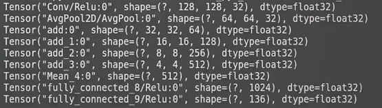

学习率：学习率采用衰减学习率，初始学习率为0.001，衰减步长为1000步，每次衰减0.98，定义`update_ops`对`batchnorm层`进行更新，具体代码如下：

```Python
global_step = tf.Variable(0, trainable=False)
lr = tf.train.exponential_decay(0.001, global_step,
                                decay_steps=1000,
                                decay_rate=0.98,
                                staircase=False)
update_ops = tf.get_collection(tf.GraphKeys.UPDATE_OPS)
with tf.control_dependencies(update_ops):
    train_op = tf.train.AdamOptimizer(lr).minimize(loss, global_step)
```
模型共训练150000次，并对模型和日志信息进行保存，loss曲线如下图所示：

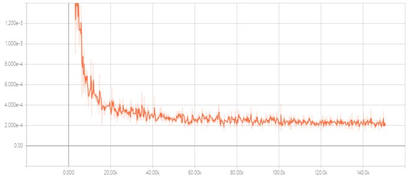


### 7.3 模型固化

模型固化部分的网络结构与模型训练中的基本一致，需要将`is_training`修改为`False`、`keep_prob`修改为`1.0`,将`shape`中的`None`置为`1`表示每次处理一张图片，修改前后的代码如下：

```Python
#修改前：input_x = tf.placeholder(tf.float32, shape=[None, 128, 128, 3])
input_x = tf.placeholder(tf.float32, shape=[1, 128, 128, 3])
#修改前：logits = SENet(input_x, is_training=True, keep_prob=0.8)
logits = SENet(input_x, is_training=False, keep_prob=1.0)
根据读取到的ckpt文件恢复当前的graph，定义输出的网络节点的对应部分，并保存pb文件，相关代码如下：
    coord = tf.train.Coordinator()
    tf.train.start_queue_runners(sess=session, coord=coord)
    init_op = tf.group(tf.global_variables_initializer(), tf.local_variables_initializer())
    session.run(init_op)
    ckpt = tf.train.get_checkpoint_state("models-3")
    saver.restore(session, ckpt.model_checkpoint_path)
    print(ckpt.model_checkpoint_path)
    output_graph_def = tf.graph_util.convert_variables_to_constants(session,session.graph.as_graph_def(),['fully_connected_9/Relu'])
with tf.gfile.FastGFile("face_landmark_model.pb", "wb") as f:
        f.write(output_graph_def.SerializeToString())
        f.close()
```

### 7.4 模型测试

读取打包好的pb文件，从pb文件中恢复当前的graph， 接着进行前项推理，通过`opencv`读取用于测试的人脸图片，将图片`resize`到`128 * 128`，将读取到的图片扩充为四维后传给网络，使用`opencv`对68个人脸关键点进行绘制，并显示输出结果，相关代码如下：

```Python
for im_url in im_list:
    im_data = cv2.imread(im_url)
    sp = im_data.shape
    im_data = im_data[sp[0] * 1//4:,:,:]
    im_data = cv2.resize(im_data, (128, 128))
    pred = sess.run(landmark, {"Placeholder:0":
                                   np.expand_dims(im_data, 0)})
    pred = pred[0]
    for i in range(0, 136, 2):
        cv2.circle(im_data, (int(pred[i] * 128), int(pred[i+1] * 128)), 2, (0, 255, 0), 2)
    cv2.imshow("test", im_data)
    cv2.waitKey(0)
```

人脸关键点定位的模型测试结果如下图所示：


## 8 参考资料

{}
* [人脸关键点对齐](https://www.jianshu.com/p/e4b9317a817f)
* [人脸对齐（十）--人脸对齐综述](https://blog.csdn.net/App_12062011/article/details/81777923?depth_1-utm_source=distribute.pc_relevant.none-task&utm_source=distribute.pc_relevant.none-task)
* [人脸特征点检测（四）——Tasks-Constrained DCN（TCDCN）](https://blog.csdn.net/qq_28618765/article/details/78128619?depth_1-utm_source=distribute.pc_relevant.none-task&utm_source=distribute.pc_relevant.none-task)
* [人脸关键点检测9——DAN](https://blog.csdn.net/u013841196/article/details/81048054)
* [SE-Inception v3架构的模型搭建（keras代码实现）](https://www.tinymind.cn/articles/3764)
* [对SE_ResNet的理解](https://blog.csdn.net/qq_22764813/article/details/95051082)
{}
