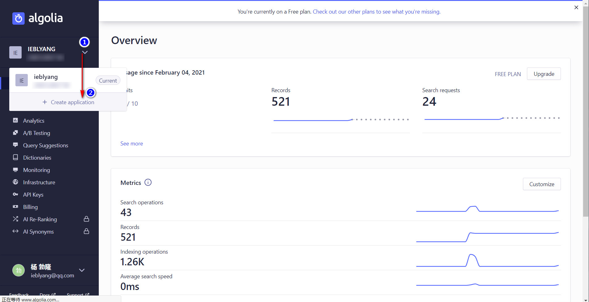
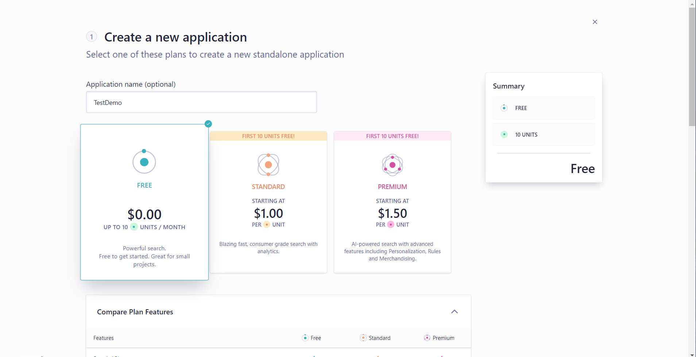
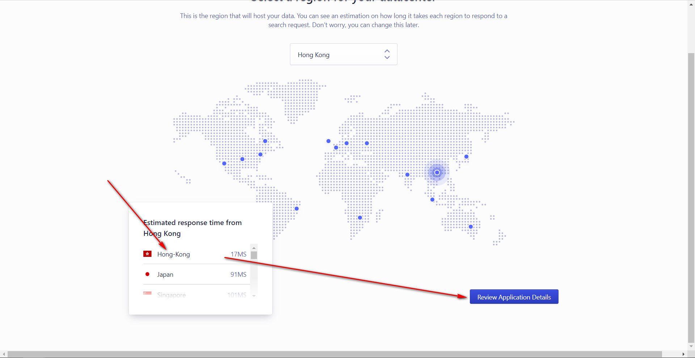
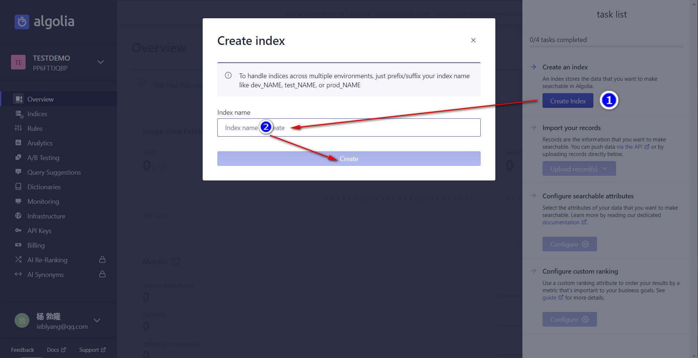
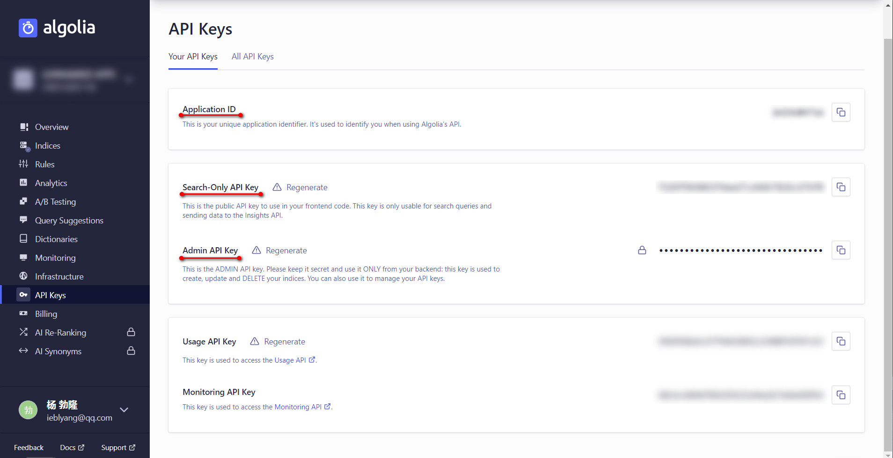
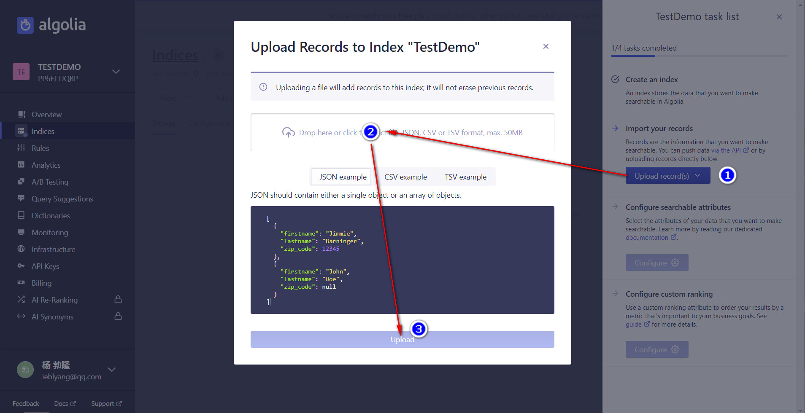
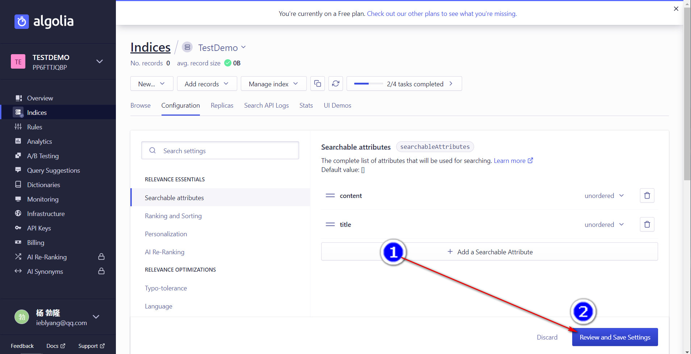
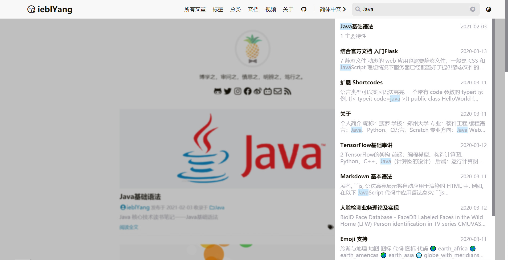

# Hugo添加Algolia搜索支持


这篇文章介绍了如何在Hugo上添加Algolia搜索支持。

以 LoveIt 主题为例。

<!--more-->

{}  
* Windows 10  
* hugo_extended_0.68.3_Windows-64bit
{}

## 1 注册账户

Algolia官网：<https://www.algolia.com/>


按步骤注册即可

## 2 创建空索引

注册成功后系统会引导创建应用和索引，如果未创建，请手动创建


流程如下：

* 创建应用



* 选择免费的方案



* 选择服务器所在地



* 创建空索引



## 3 配置API Keys

点击导航栏`API Keys`，记录信息(Application ID, Search-Only API Key, Admin API Key)



在`config.toml`中进行配置

```
      # 搜索配置
      [languages.zh-cn.params.search]
        enable = true
        # 搜索引擎的类型 ("lunr", "algolia")
        type = "algolia"
        # 文章内容最长索引长度
        contentLength = 4000
        # 搜索框的占位提示语
        placeholder = ""
        # 最大结果数目
        maxResultLength = 10
        # 结果内容片段长度
        snippetLength = 50
        # 搜索结果中高亮部分的 HTML 标签
        highlightTag = "em"
        # 是否在搜索索引中使用基于 baseURL 的绝对路径
        absoluteURL = false
        [languages.zh-cn.params.search.algolia]
          index = "ieblyang"
          appID = "Your Application ID"
          searchKey = "Your Search-Only API Key"
```

## 4 生成索引文件

使用`hugo` 命令后，public文件夹下生成`index.json`文件

## 5 上传索引文件

### 5.1 手动上传

点击Upload Record(s)上传索引文件



* 第一次上传需要继续配置可搜索属性



* 自定义排序规则（Custom Ranking）可以暂时不做配置

### 5.2 自动上传

* 在`blog`目录下执行以下命令

```Bash
npm init
npm install atomic-algolia --save
```
执行完后会生成 `node_modules` 文件夹（如果代码托管在 GitHub 的话，可以在.gitignore中添加`/node_modules`以忽略该文件）。在项目根目录下还会有一个`package.json`文件，打开该文件，在`scripts`下添加`"algolia": "atomic-algolia"`后如下：

```Json
"scripts": {
    "test": "echo \"Error: no test specified\" && exit 1",
    "algolia": "atomic-algolia"
  },
```

在博客项目根目录下建立一个.env文件，文件内容如下：


**请按照自己的应用进行配置**
```
ALGOLIA_APP_ID=2W*****71W
ALGOLIA_INDEX_NAME=ieblyang
ALGOLIA_INDEX_FILE=public/index.json
ALGOLIA_ADMIN_KEY=a8b6be4*****ad0c525*****f00cd2af
```
执行下面的命令更新Algolia:

```Bash
npm run algolia
```
## 6 效果展示

启动测试环境

```Bash
hugo serve -e production
```


## 7 参考资料

{}
* [Hugo添加Algolia搜索支持](https://edward852.github.io/post/hugo%E6%B7%BB%E5%8A%A0algolia%E6%90%9C%E7%B4%A2%E6%94%AF%E6%8C%81/)
* [采用 Algolia 作为 Hugo 搜索方案](https://10101.io/2018/11/23/search-with-algolia-in-hugo)
{}


