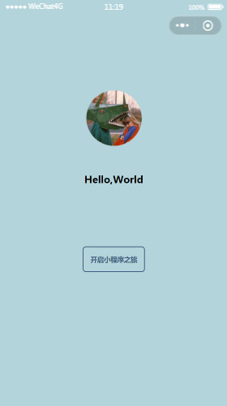

# 结合官方文档，入门微信小程序

结合微信小程序官方文档，学习小程序基础必背知识

<!--more-->

## 1 什么是微信小程序

### 1.1 张小龙这样定义

* 不需要下载安装即可使用
* 用户“用完即走”，不用关心是否安装太多应用
* 应用将无处不在，随时可用

### 1.2 小程序特点

* 小程序适合做简单的、用完即走的应用
* 小程序适合低频的应用
* 小程序适合性能要求不高的应用

## 2 小程序入门基础知识

* 小程序文件类型与目录结构
* 注册小程序页面，View、Text等组件的基本用法
* Flex弹性盒子模型
* 移动端分辨率及小程序自适应单位RPX

### 2.1 小程序类型与目录结构 

├── app.js  
├── app.json  
├── app.wxss  
├── pages  
│   │── index  
│   │   ├── index.wxml  
│   │   ├── index.js  
│   │   ├── index.json  
│   │   └── index.wxss  
│   └── logs  
│       ├── logs.wxml  
│       └── logs.js  
├── utils  
└── project.config.json
{}
* pages 存放页面  

|文件|作用|举例（英雄联盟）|
|----|----|----|
|js  |逻辑|“技能”|
|wxml|骨架|“英雄”|
|wxss|样式|“皮肤”|
|json|配置|“符文”|

* utils 工具类
* app.js 	应用程序级别的逻辑
* app.json 	应用程序级别的配置
* app.wxss 	应用程序级别的全局样式
* project.config.json 项目配置文件
* **就近原则** 页面配置 高于 全局配置
{}

### 2.2 注册小程序页面

{}
官方文档 -> 框架 -> 小程序配置 -> 全局配置 -> pages
{}

app.json -> pages

* `pages` 用于指定小程序由哪些页面组成，每一项都对应一个页面的 路径（含文件名）信息。文件名不需要写文件后缀，框架会自动去寻找对于位置的 `.json`, `.js`, `.wxml`, `.wxss` 四个文件进行处理。
* 数组的第一项代表小程序的初始页面（首页）。小程序中新增/减少页面，都需要对 `pages` 数组进行修改。

```Json
{
  "pages": ["pages/index/index", "pages/logs/logs"]
}
```

### 2.3 基本组件

#### 2.3.1 view

{}
官方文档 -> 组件 -> 视图容器 -> view
{}

* `<view> </view>` 相当于网页中的 `<div> </div>`

* 作用：容器、分隔文档

#### 2.3.2 text

{}
官方文档 -> 组件 -> 基础内容 -> text
{}

* 写文本时最好用`<text> </text>`包裹，便于对文件设置样式和添加标签
* 不建议直接使用`<button> </button>`，可以使用`<view> <text> 按钮 </text> </view>`的形式来实现按钮

#### 2.3.3 window

{}
官方文档 -> 框架 -> 小程序配置 -> 全局配置 -> window
{}

* 用于设置小程序的状态栏、导航条、标题、窗口背景色。

```Json
{
  "window": {
    "navigationBarBackgroundColor": "#ffffff",
    "navigationBarTextStyle": "black",
    "navigationBarTitleText": "微信接口功能演示",
    "backgroundColor": "#eeeeee",
    "backgroundTextStyle": "light"
  }
}
```

### 2.4 Flex弹性盒子模型

* Flex弹性盒子模型是一种当页面需要适应不同的屏幕大小以及设备类型时确保元素拥有恰当的行为的布局方式。
* 目的:是提供一种更加有效的方式来对一个容器中的子元素进行排列、对齐和分配空白空间。
* 弹性盒子由弹性容器(Flex container)和弹性子元素(Flex item)组成。
* 弹性容器通过设置 display 属性的值为 flex 或 inline-flex将其定义为弹性容器。
* 弹性容器内包含了一个或多个弹性子元素。
* [常用属性](https://www.runoob.com/css3/css3-flexbox.html)

```Css
.container{
  display: flex;
  flex-direction:column;  /*垂直分布*/
  align-items: center;   /*元素居中*/
}
```

### 2.5 移动端分辨率及小程序自适应单位RPX

{}
官方文档 -> 指南 -> 小程序框架 -> 视图层 -> wxss
{}
  
 | 设备           | 屏幕尺寸|分辨率(pt)|Reader|分辨率(px)|渲染后   |PPI|
 |----------------|--------|---------|-------|---------|--------|---|
 |iPhone 3GS      |3.5寸   |320x480  |@1x    |320x480  |空       |163|
 |iPhone 4/4s     |3.5寸   |320x480  |@2x    |640x960  |空       |326|
 |iPhone 5/5S/5C  |4.0寸   |320x568  |@2x    |640x1136 |空       |326|
 |iPhone 6/6S     |4.7寸   |375x667  |@2x    |750x1334 |空       |326|
 |iPhone 6/6S Plus|5.5寸   |414x736  |@3x    |1242x2208|1080x1920|401|

* 小程序图片默认值 width:300px;height:225px
* 图片使用`px`图片不会随机型、分辨率等的变化而变化
* 图片使用`rpx`图片会随机型、分辨率等的变化而变化
* pt 就是point，是一种固定长度的度量单位，是能够使用测量设备测得的长度，是排版印刷中常用的文字大小单位。
* px 就是表示pixel，像素，是屏幕上显示数据的最基本的点。
	* px可以在计算机屏幕上，能达到预期的效果，在打印机和其它的高分辨率设备上，它又能取得所希望的效果。
	* px是一个点，它不是自然界的长度单位，谁能说出一个“点”有多长多大么？可以画的很小，也可以很大。如果点很小，那画面就清晰，我们称它为“分辨率高”，反之，就是“分辨率低”。所以，“像素”的大小是会“变”的，也称为“相对长度”。
* ppi Pixels Per Inch也叫像素密度，所表示的是每英寸所拥有的像素数量。因此PPI数值越高，即代表显示屏能够以越高的密度显示图像，当然，显示的密度越高，拟真度就越高。
* 公式表达为 $ PPI=\sqrt{(X^2+Y^2)} / Z $ 
	* $X$：长度像素数；
	* $Y$：宽度像素数；
	* $Z$：屏幕大小

## 3 一个简单的页面



### 3.1 目录结构

├── app.js  
├── app.json  
├── app.wxss  
├── images
├── pages  
│   └── welcome  
│       ├── welcome.wxml  
│       ├── welcome.js  
│       └── welcome.wxss    
└── project.config.json

### 3.2 代码展示

#### app.json

```Json
{
  "pages": [
    "pages/welcome/welcome"
  ],
  "window": {
    "navigationBarBackgroundColor": "#b3d4db"
  },
  "sitemapLocation": "sitemap.json"
}
```

#### app.wxss

```Css
text{
  font-family:MicroSoft Yahei;
}
```

#### welcome.wxml

```Html
<!-- wxml 是用来编写页面骨架的文件-->
<!-- <div> 容器 分隔文档 -->
<view class="container">
<!--
  <image style="width:200rpx; height:200rpx" src="/images/avatar.png"></image>
  -->
  <image  class="user-avatar" src="/images/avatar.png"></image>
  <!-- width:300px height:225px -->
    <text class="user-name">Hello,World</text>
    <view class= "moto-container">
    <text class="moto" >开启小程序之旅</text>
    </view>
</view>
```
#### welcome.js

```JavaScript
//js不能为空，否则会报错，至少添加空的Page代码
Page({
  
})
```

#### welcome.wxss

```Css
.container{
  display: flex;
  flex-direction:column; /*垂直分布*/
  align-items: center; /*元素居中*/
  /*background-color: #b3d4db;*/
}
page{
  background-color: #b3d4db;
  height:100%;
}
.user-avatar{
  width:200rpx;
  height:200rpx;
  margin-top:160rpx;
}
.user-name{
  font-size:32rpx;
  font-weight:bold;
  margin-top:80rpx;
  /*font-family: MicroSoft Yahei;*/
}
.moto{
  font-size:22rpx;
  font-weight:bold;
  /*font-family: MicroSoft Yahei;*/
  line-height: 80rpx;
  color: #405f80
}
.moto-container{
  margin-top:200rpx;
  border:1px solid #405f80;
  height:80rpx;
  width:200rpx; 
  border-radius:5px;   /*设置圆角*/
  text-align:center;
}

```
