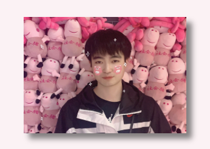

# 微信小程序给图片添加阴影效果


<!--more-->

## 1 实现方法
{}

```Css
box-shadow: h-shadow v-shadow blur spread color inset;
```

* `h-shadow`：必需设置的值，定义水平阴影的位置。允许负值。

* `v-shadow`：必需设置的值，定义垂直阴影的位置。允许负值。

* `blur`：可选设置的值，定义模糊距离。

* `spread`：可选设置的值，定义阴影的尺寸。

* `color` ：可选设置的值，定义阴影的颜色。如果没有设置值，颜色值基于浏览器显示，建议设置。

* `inset`：可选设置的值，设置后可将外部阴影 (outset) 改为内部阴影。

{}

## 2 代码实例
```Html
<!-- pages/index/index.wxml -->
<view class="couple-box">
  <image src="../../images/w1.jpg" class="couple-image"></image>
</view>
```
```Css
/* pages/index/index.wxss */
.couple-image{
  width:70%;
  height:50%;
  margin-top:60rpx;
  box-shadow: 15rpx 15rpx 15rpx rgba(10,10,10,.5);
}
```
* 实现效果如下图所示:   

## 4 参考资料
{}
* [css怎么给图片添加阴影效果？图片添加阴影的两种方法（代码实例）](https://www.php.cn/css-tutorial-411821.html)
{}
