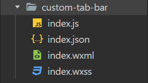
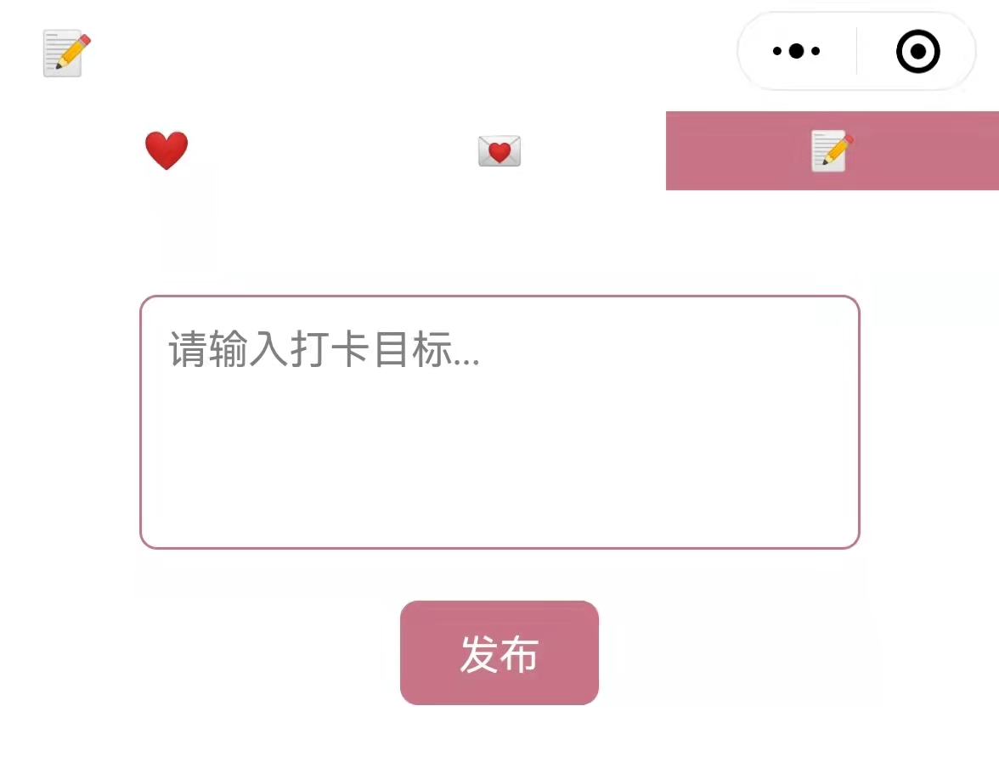

# 微信小程序之tabBar（官方原生与官方自定义）


<!--more-->


{}
* 微信小程序分为`tabBar`页面与应用内页面，`tabBar`页面从表面来说就是页面中含有tabBar切换组件的页面，从小程序代码里讲就是在`app.json`里配置了`tarBar`选项的页面。
* 目前有原生`tabBar`，还有官方的自定义`tabBar`。
* 原生`tabBar`只需要在`app.json`里配置好相关`tab`选项就可以了。
* 官方的自定义`tabBar`需要在根目录定义一个自定义组件。
{}

## 1 官方原生 tabBar

* 只需要在`app.json`中进行配置即可

```Json
"tabBar": {
    "color": "#ff0000", //颜色
    "selectedColor": "#ffff00",    //选中时的颜色
    "backgroundColor": "#1697eb",  //tab背景色
    "borderStyle": "black",  //tabBar盒子上面的border颜色，只支持black 与 white
    "list": [
      {
        "pagePath": "pages/tabOne/tabOne", //此处路径要写不带 ‘/’的
        "text": "tabOne",            //tab名字
        "iconPath": "image/icon_API.png",  //tab图标
        "selectedIconPath": "image/icon_API_HL.png" //选中时的tab图标
      },
      {
        "pagePath": "pages/tabTwo/tabTwo",
        "text": "tabTwo",
        "iconPath": "image/icon_API.png",
        "selectedIconPath": "image/icon_API_HL.png"
      },
      {
        "pagePath": "pages/tabThree/tabThree",
        "text": "tabThree",
        "iconPath": "image/icon_API.png",
        "selectedIconPath": "image/icon_API_HL.png"
      },
    ],
    "position": "bottom",  //tabBar的位置 top 或 bottom
    "custom": false  //自定义tabBar时为true
  }
```
## 2 官方自定义tabBar
* 将app.json中的custom改为true
```Json
 "tabBar": {
    "custom": true,
    "position": "top",
    "list": [
      {
        "pagePath": "pages/index/index"
      },
      {
        "pagePath": "pages/message/message"
      },
      {
        "pagePath": "pages/goal/goal"
      }
    ]
  },
```
* 在根目录新建一个自定义组件 `custom-tab-bar`  


* `cunsom-tab-bar/index.js`
```JavaScript
Component({
  data: {
    selected: 0,
    color: "#ffffff",
    selectedColor: "#c97587",
    "list": [
      {
        "pagePath": "/pages/index/index",
        "text": "❤️",
        "iconPath": "",
        "selectedIconPath": ""
      },
      {
        "pagePath": "/pages/message/message",
        "text": "💌",
        "iconPath": "",
        "selectedIconPath": ""
      },
      {
        "pagePath": "/pages/goal/goal",
        "text": "📝",
        "iconPath": "",
        "selectedIconPath": ""
      },
    ],
  },
  attached() {
  },
  methods: {
    switchTab(e) {
      const data = e.currentTarget.dataset
      const url = data.path
      //切换tab时，改变路由地址
      wx.switchTab({url})
      this.setData({
        //切换tab时，改变当前激活的序号，改变tab颜色图标等样式  
        selected: data.index
      })
    }
  }
})
```
* `custom-tab-bar/index.json`
```Json
{
  "component": true
}
```

* `custom-tab-bar/index.wxml`
```Html
<!--custom-tab-bar/index.wxml-->
<cover-view class="tab-bar">
  <cover-view class="tab-bar-border"></cover-view>
  <cover-view wx:for="{{list}}" wx:key="index" class="tab-bar-item" style="background-color: {{selected === index ? selectedColor : color}}" data-path="{{item.pagePath}}" data-index="{{index}}" bindtap="switchTab">
    <!--<cover-image src="{{selected === index ? item.selectedIconPath : item.iconPath}}"></cover-image>-->
    <cover-view>{{item.text}}</cover-view>
  </cover-view>
</cover-view>
```

* `custom-tab-bar/index.css`
```Css

.tab-bar {
  position: fixed;
  top: 0;
  left: 0;
  right: 0;
  height: 60rpx;
  background: white;
  display: flex;
  padding-bottom: env(safe-area-inset-bottom);
}

.tab-bar-border {
  background-color: white;
  position: absolute;
  left: 0;
  top: 0;
  width: 100%;
  height: 1px;
  transform: scaleY(0.5);
}

.tab-bar-item {
  flex: 1;
  text-align: center;
  display: flex;
  justify-content: center;
  align-items: center;
  flex-direction: column;
}

.tab-bar-item cover-image {
  width: 27px;
  height: 27px;
}

.tab-bar-item cover-view {
  font-size: 30rpx;
}

```
* 在每个`tab`页面里的`tab.json`配置`usingComponents`选项
```Json
{
  "usingComponents": {},
  "navigationBarBackgroundColor": "#ffffff",
  "navigationBarTitleText": "📝",
  "navigationBarTextStyle": "black"
 
}
```
* 在每个`tab`页面的`onShow`生命周期函数里加上以下代码
```JavaScript
onShow: function () {
    if (typeof this.getTabBar === 'function' &&
      this.getTabBar()) {
      this.getTabBar().setData({
        //就是页面显示出来后，让相应的tab改变颜色 图标等样式
        selected: 3 // 根据tab的索引值设置
      })
    }
  },
```
## 3 效果展示

## 4 参考资料
{}
* [微信小程序官方文档](https://developers.weixin.qq.com/miniprogram/dev/api/ui/interaction/wx.showToast.html)
* [微信小程序之tabBar（官方原生与官方自定义）](https://www.jianshu.com/p/91cd8db69739)
* [小程序（三）配置tabbar及自定义tabbar样式](https://blog.csdn.net/qq_39708228/article/details/108812300)
{}
