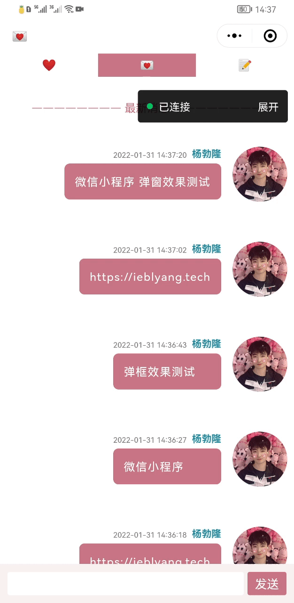

# 微信小程序实现聊天输入框随键盘弹起，内容不被顶起


<!--more-->


{}
* 弹出键盘后，不把内容顶起来，监听键盘高度变化，自动设置输入框和内容的高度
{}

## 1 实现代码

### 1.1 `message/message.js`
```JavaScript
// pages/message/message.js
  data: {
    statsuBarHeight: app.globalData.statsuBarHeight,
    headHeight: 40,
    chatListHeight: 0,
    keyboardHeight: 0,
    inutPanelHeight: 50,
    curMessage: "",
  },

  //设置聊天窗高度
  setChatListHeight() {
    this.setData({
      chatListHeight: app.globalData.sysHeight - app.globalData.statsuBarHeight - this.data.headHeight - this.data.keyboardHeight - this.data.inutPanelHeight
    })
  },

  //隐藏键盘
  hideKeyboard() {
    wx.hideKeyboard();
    //this.hideMediaPanel();
  },

  onLoad: function (options) {
    var that = this;
    that.getMessage();
    this.setChatListHeight();
    wx.onKeyboardHeightChange(res => { //监听键盘高度变化
      this.setData({
        keyboardHeight: res.height
      });
      this.setChatListHeight();
      //this.scroll2Bottom();
    });
  },
  /**
   * 消息获取
   */
  inputMessage: function (e) {
    this.setData({
      inputMessage: e.detail.value,
    })
  },
  /**
   * 消息发送 
   */
  setMessage: function () {
    var that = this;
    var curMessage = that.data.inputMessage;
    if (curMessage.trim() === "") {
      app.showFail("不可以发送空消息")
      return;
    }
    wx.request({
      url: app.buildUrl("/message/setMess"),
      header: app.getRequestHeader(),
      data: {
        message: this.data.inputMessage,
      },
      success: function (res) {
        if (res.data.code == 200) {
          //清空输入框
          that.setData({
            inputMessage: ''
          })
          app.showSuccess("发送成功！")
          that.onLoad();
        }else{
          app.showFail("发送失败！")
        }
      }  
    })
  },

```

### 1.2 `message/message.json`
```Json
  "usingComponents": {},
  "navigationBarBackgroundColor": "#ffffff",
  "navigationBarTitleText": "💌",
  "navigationBarTextStyle": "black"
}

```


### 1.3 `message/message.wxml`
```Html
<view class="input-panel" style="bottom:{{keyboardHeight}}px">
  <input adjust-position="{{false}}" hold-keyboard="{{true}}" bindinput="inputMessage" value="{{inputMessage}}"/>
  <view class="send-btn" bindtap="setMessage">发送</view>
</view>
```

### 1.4 `message/message.wxss`
```Css
.input-panel {
  display: flex;
  background: #FBF2F4;
  height: 100rpx;
  position: fixed;
  width:100%;
  padding:0rpx 20rpx;
  align-items: center;
  box-sizing: border-box;
}
 
.input-panel input {
  flex: 1;
  width: 100%;
  background: #ffffff;
  height: 60rpx;
  line-height: 60rpx;
  box-sizing: border-box;
  padding:0px 5px;
  border-radius: 3px;
}
 
.send-btn {
  display: inline-block;
  padding: 0rpx 20rpx;
  color: #fff;
  background: #c97587;
  border-radius: 6rpx;
  line-height:60rpx;
  margin-left:10rpx;
}
```

### 1.5 `app.js`

```JavaScript
  onLaunch() {
    const res = wx.getSystemInfoSync()
    var statusbarH = res.statusBarHeight
    this.globalData.statsuBarHeight=statusbarH;
    this.globalData.sysWidth = res.screenWidth;
    this.globalData.sysHeight = res.screenHeight;
  },
  
  globalData: {
    //键盘
    statsuBarHeight:0,
    sysWidth:0,
    sysHeight:0,
  },
```

## 2 效果展示


