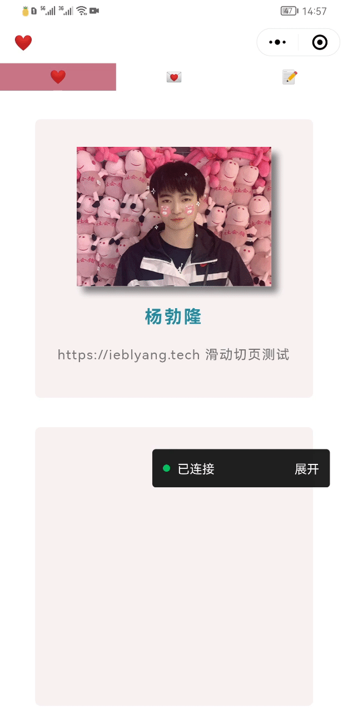

# 微信小程序实现左右滑动切换页面


<!--more-->


{}
* 很多用户已经有了滑动切换页面的习惯，滑动切页比点击更容易进行操作
* 看了网上很多相关博客，这个方案在我本人亲测后达到了不错的效果
{}

## 1 实现代码

### 1.1 `message/message.js`

```JavaScript
// pages/message/message.js
var startX, endX;
var moveFlag = true;// 判断执行滑动事件
  Page({
    //滑动
    touchStart: function (e) {
      startX = e.touches[0].pageX; // 获取触摸时的原点
      moveFlag = true;
    },
    // 触摸移动事件
    touchMove: function (e) {
      endX = e.touches[0].pageX; // 获取触摸时的原点
      if (moveFlag) {
        if (endX - startX > 100) {
          this.moveleft();
          moveFlag = false;
        }
        if (startX - endX > 100) {
          this.moveright();
          moveFlag = false;
        }
      }
  
    },

    // 触摸结束事件
    touchEnd: function (e) {
      moveFlag = true; // 回复滑动事件
      
    },

    // 响应向左滑动
    moveleft() {
      wx.switchTab({ //由于我配置了tabBar，需要tab之间切换，所以使用了swithTab
        url: '/pages/index/index', 
      });
    },

    // 响应向右滑动
    moveright() {
      wx.switchTab({
        url: '/pages/goal/goal',
      });
    },
  })
```

### 1.2 `message/message.wxml`
```Html
<view  bindtouchstart="touchStart" bindtouchmove="touchMove" bindtouchend="touchEnd">

</view>
```


## 2 效果展示


